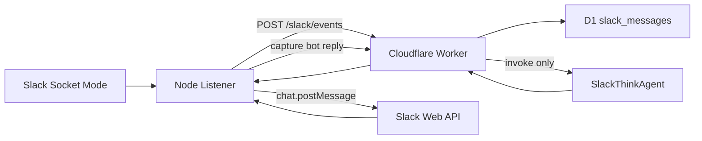
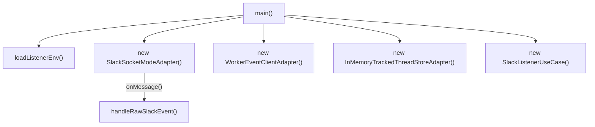
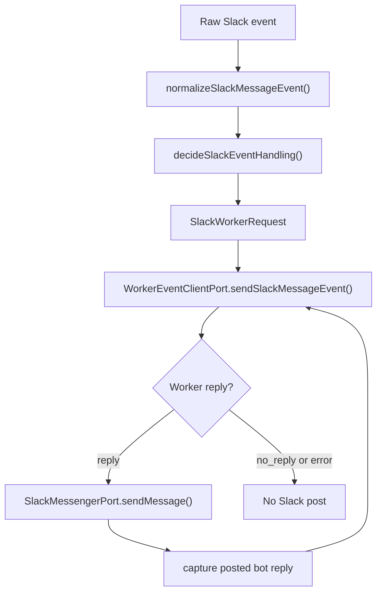
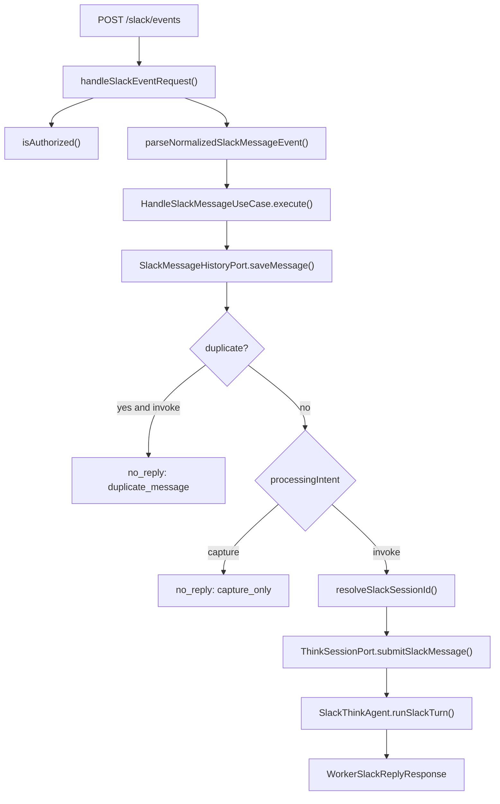
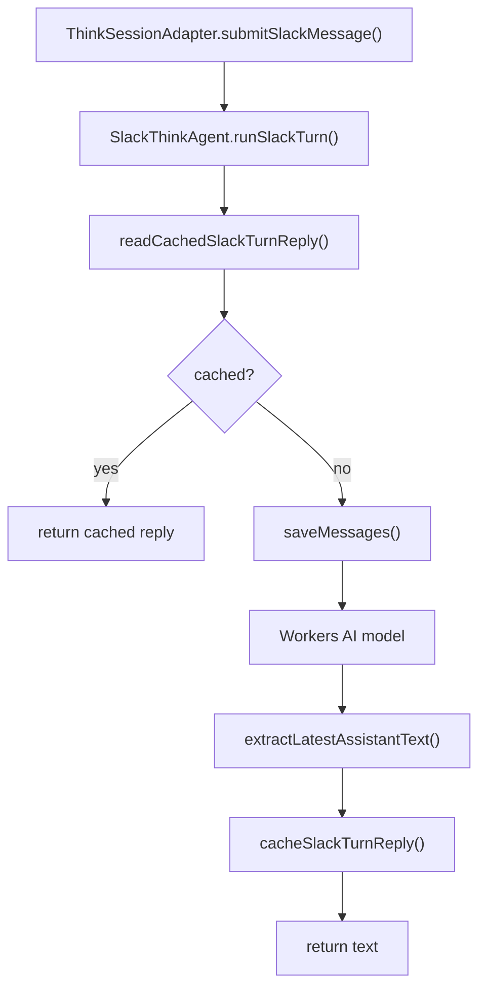
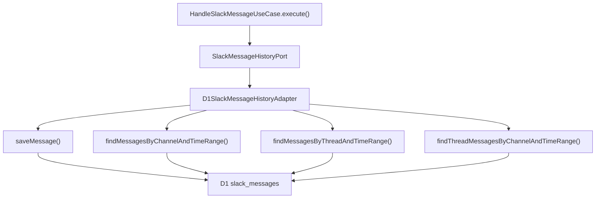
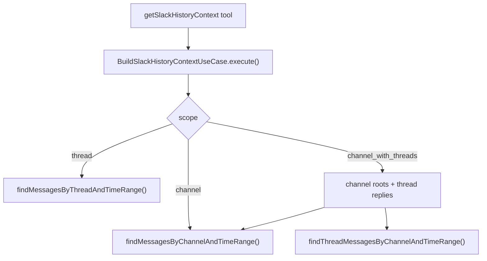

# Slack AI Agent v3

Slack AI Agent v3 is a Slack assistant built from a thin Node.js Slack Socket Mode listener, a Cloudflare Worker application boundary, and a durable `@cloudflare/think` agent. The listener owns Slack WebSocket and Slack Web API integration. The Worker owns validation, history capture, session routing, and Think orchestration. D1 stores passive Slack history so the agent can summarize thread and channel context.

## Runtime Architecture



The code follows feature-first hexagonal architecture:

- Entrypoints compose dependencies and route requests.
- Use cases implement behavior.
- Ports define replaceable boundaries.
- Adapters contain Slack SDK, Worker HTTP, D1, Think, and logging details.

## Key Entrypoints

| Runtime | Entrypoint | Command |
| --- | --- | --- |
| Slack listener | `src/cmd/listener/index.ts` | `npm run listener:slack` |
| Cloudflare Worker | `src/cmd/worker/index.ts` | `npm run worker:dev` |
| Worker deploy | `src/cmd/worker/index.ts` | `npm run worker:deploy` |

General commands:

```sh
npm run typecheck
npm test
npx wrangler deploy --dry-run
```

## Listener Flow

`main()` in `src/cmd/listener/index.ts` loads listener environment with `loadListenerEnv()`, creates adapters, resolves the bot user id, and wires Slack events to `SlackListenerUseCase.handleRawSlackEvent()`.



`SlackListenerUseCase.handleRawSlackEvent()` does the listener-side work:



Important listener methods and functions:

- `SlackSocketModeAdapter.onMessage()` registers listener callbacks.
- `SlackSocketModeAdapter.start()` starts Socket Mode.
- `SlackSocketModeAdapter.resolveBotUserId()` calls Slack `auth.test`.
- `SlackSocketModeAdapter.sendMessage()` calls Slack `chat.postMessage` and returns the posted Slack `messageTs`.
- `normalizeSlackMessageEvent()` converts raw Slack events into `NormalizedSlackMessageEvent`.
- `decideSlackEventHandling()` chooses `processingIntent: "capture" | "invoke"`.
- `WorkerEventClientAdapter.sendSlackMessageEvent()` sends the normalized request to the Worker.

## Processing Rules

The listener forwards bot-visible messages to the Worker with a processing intent:

| Slack event | Intent | Behavior |
| --- | --- | --- |
| Direct message (`message.im`) | `invoke` | Save history and run Think. |
| `app_mention` | `invoke` | Save history and run Think. |
| Channel/group message with bot mention | `invoke` | Save history and run Think. |
| Channel/group message without bot mention | `capture` | Save history only. |
| MPIM with bot mention | `invoke` | Save history and run Think. |
| MPIM without bot mention | `capture` | Save history only. |
| Posted bot reply | `capture` | Save history only. |

The current normalizer ignores hidden events, bot-authored Slack events, `message_changed`, and `message_deleted`. File share events can be retained when they include files or attachments, but file bytes are not stored.

## Worker Flow

`fetch()` in `src/cmd/worker/index.ts` handles `POST /slack/events` with `handleSlackEventRequest()`. Other requests are passed to `routeAgentRequest()` for Think/Agents routing.



Important Worker methods and functions:

- `handleSlackEventRequest()` validates method, bearer token, JSON body, and request shape.
- `parseNormalizedSlackMessageEvent()` validates `SlackWorkerRequest` with Zod.
- `HandleSlackMessageUseCase.execute()` saves history, handles duplicates, and invokes Think when needed.
- `resolveSlackSessionId()` maps Slack context to a Think session id.
- `ThinkSessionAdapter.submitSlackMessage()` calls `SlackThinkAgent.runSlackTurn()`.
- `D1SlackMessageHistoryAdapter.saveMessage()` inserts Slack history idempotently.

## Think Agent Flow

The Think agent is `SlackThinkAgent` in `src/modules/agent/think-agent.ts`.



`SlackThinkAgent` uses:

- `getModel()` to create a Workers AI model through `createWorkersAI()`.
- `getSystemPrompt()` to load `buildSlackAgentSystemPrompt()`.
- `getTools()` to expose `getSlackHistoryContext`.
- `runSlackTurn()` to submit Slack user messages to Think and return assistant text.
- `slack_turn_replies` in Think SQLite storage to cache replies by idempotency key.

The default model is configured in `wrangler.jsonc`:

```txt
AI_MODEL=@cf/google/gemma-4-26b-a4b-it
```

## Slack History And Summaries

Slack history is stored in D1 table `slack_messages` through `SlackMessageHistoryPort`.



Captured history includes:

- User messages the bot can see after the listener starts.
- Direct messages, channel messages, group messages, MPIM messages, and thread messages.
- Bot replies after Slack accepts `chat.postMessage` and returns a message timestamp.

Captured history does not currently include:

- Backfilled messages from before the listener was running.
- Message edits or deletes.
- File bytes or attachment contents.
- Private channel messages unless the bot is a member.

Summary context is built by `BuildSlackHistoryContextUseCase.execute()`:



Supported summary scopes:

- `thread`
- `channel`
- `channel_with_threads`

## Idempotency

Slack can deliver more than one event for the same visible message. For example, a bot mention can arrive as both `app_mention` and `message.groups`.

Current idempotency behavior:

- `normalizeSlackMessageEvent()` uses a stable message key: `slack:{teamId}:{channelId}:{messageTs}` unless Slack provides `client_msg_id`.
- `D1SlackMessageHistoryAdapter.saveMessage()` uses `INSERT OR IGNORE`.
- `HandleSlackMessageUseCase.execute()` returns `no_reply` with `reason: "duplicate_message"` for duplicate invoke events.
- `SlackThinkAgent.runSlackTurn()` caches Think replies in `slack_turn_replies`.

## Contracts

The listener sends `SlackWorkerRequest` JSON to the Worker:

```ts
type SlackWorkerRequest = NormalizedSlackMessageEvent & {
  processingIntent: "capture" | "invoke";
};
```

The Worker returns `WorkerSlackReplyResponse`:

```ts
type WorkerSlackReplyResponse =
  | { status: "reply"; text: string; threadTs?: string }
  | { status: "no_reply"; reason?: string }
  | { status: "error"; code: string; message: string };
```

Common `no_reply` reasons:

- `capture_only`
- `duplicate_message`
- `empty_agent_reply`

## D1 Setup

Create the Slack history database:

```sh
npx wrangler d1 create slack-ai-agent-v3-history
```

Update `database_id` in `wrangler.jsonc` if a new database is created.

Apply local migrations for `wrangler dev`:

```sh
npx wrangler d1 migrations apply slack-ai-agent-v3-history --local
```

Apply remote migrations for deployed environments:

```sh
npx wrangler d1 migrations apply slack-ai-agent-v3-history --remote
```

If `wrangler dev` reports `D1_ERROR: no such table: slack_messages`, apply local migrations again and restart `wrangler dev` if needed.

## Environment

Create local listener environment from the template:

```sh
cp .env.example .env
```

Required listener variables:

```txt
SLACK_BOT_TOKEN
SLACK_APP_TOKEN
WORKER_SLACK_EVENT_URL
WORKER_INTERNAL_API_TOKEN
```

Optional listener variables:

```txt
SLACK_BOT_USER_ID
LOG_LEVEL
```

Required Worker secret:

```txt
WORKER_INTERNAL_API_TOKEN
```

Worker bindings and vars in `wrangler.jsonc`:

```txt
AI
AI_MODEL
SLACK_THINK_AGENT
SLACK_HISTORY_DB
```

## Repository Layout

```txt
src/
  cmd/
    listener/
    worker/
  adapters/
    logger/
    slack/
    storage/
    think/
    worker/
  modules/
    agent/
    slack/
    slack-listener/
  ports/
  shared/
  tools/
migrations/
proto/features/
```

Important files:

- `src/modules/slack-listener/slack-event-normalizer.ts`
- `src/modules/slack-listener/slack-event-filter.ts`
- `src/modules/slack-listener/slack-listener.use-case.ts`
- `src/modules/slack/slack.handler.ts`
- `src/modules/slack/handle-slack-message.use-case.ts`
- `src/modules/slack/slack-history-summary.use-case.ts`
- `src/modules/agent/think-agent.ts`
- `src/adapters/storage/d1-slack-message-history.adapter.ts`
- `migrations/0001_slack_messages.sql`

## Verification

Run before completing TypeScript changes:

```sh
npm run typecheck
npm test
```

Run for Worker/config changes:

```sh
npx wrangler deploy --dry-run
```

Run for D1 migration changes:

```sh
npx wrangler d1 migrations apply slack-ai-agent-v3-history --local
```

## Agent Guidance

See `AGENTS.md` for detailed coding-agent rules, repository workflow, commit conventions, architecture constraints, and cleanup rules.
