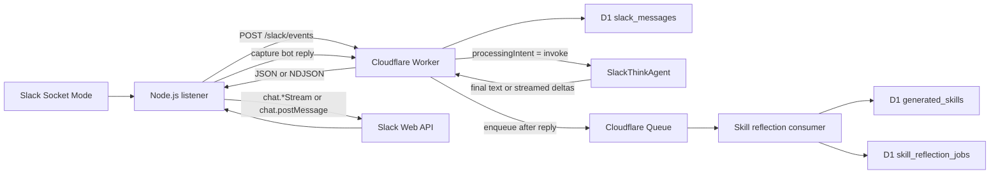
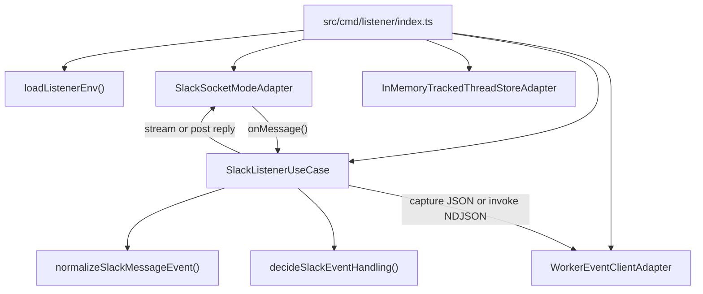
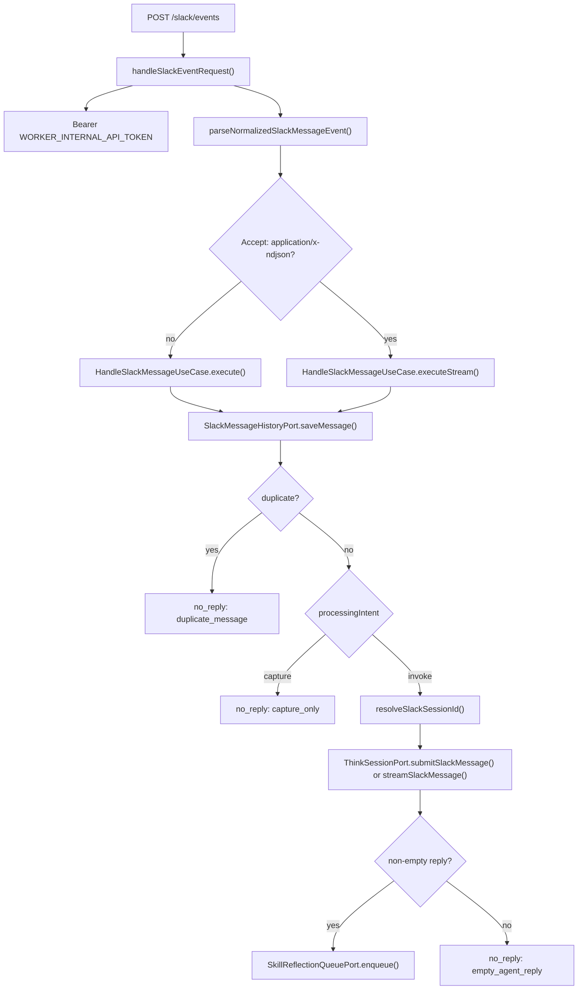
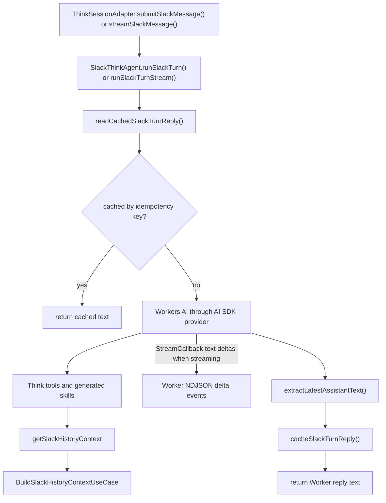
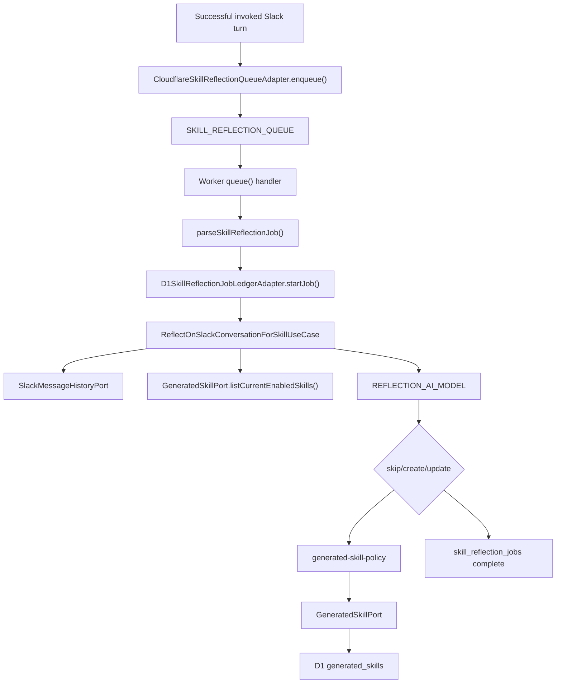

# Slack AI Agent v3

Slack AI Agent v3 is a Slack assistant built around a deliberately split runtime:

```text
Node.js Slack Listener -> Cloudflare Worker -> @cloudflare/think Agent
```

The Node.js listener owns Slack Socket Mode and Slack Web API integration. The Cloudflare Worker owns the application boundary, request validation, Slack history capture, idempotency, Think session routing, generated-skill reflection, and queue consumption. `@cloudflare/think` owns durable agent execution and conversation state. Cloudflare D1 stores passive Slack history, generated skills, generated-skill versions, and reflection job ledger entries.

This repository favors feature-first modular hexagonal architecture. Entrypoints compose dependencies. Use cases implement behavior. Ports define replaceable boundaries. Adapters contain Slack SDK, Worker HTTP, D1, Cloudflare Queue, Think, Workers AI, and logging details.

## Current Runtime Shape



The key design rule is that the listener is a thin Slack bridge and the Worker is the application boundary. The listener can normalize Slack messages, decide whether a message should be captured or should invoke the agent, send a normalized event to the Worker, stream or post a Worker reply back to Slack, and capture that bot reply. The listener must not run AI logic, call Workers AI, read or write D1, access Durable Object storage, execute Think tools, or store long-term memory.

## Quick Start

Install dependencies:

```sh
npm install
```

Create listener local environment:

```sh
cp .env.example .env
```

Create Worker local secrets:

```sh
cp .dev.vars.example .dev.vars
```

Apply local D1 migrations before running `wrangler dev`:

```sh
npx wrangler d1 migrations apply slack-ai-agent-v3-history --local
```

Run the Worker locally:

```sh
npm run worker:dev
```

Run the Slack Socket Mode listener in another terminal:

```sh
npm run listener:slack
```

For local development, `WORKER_SLACK_EVENT_URL` should usually be:

```text
http://localhost:8787/slack/events
```

Before completing TypeScript changes, run:

```sh
npm run typecheck
npm test
```

For Worker or Wrangler config changes, also run:

```sh
npx wrangler deploy --dry-run
```

## Scripts

| Command | Purpose |
| --- | --- |
| `npm run dev` | Alias for the Slack listener entrypoint. |
| `npm run listener:slack` | Run the Node.js Slack Socket Mode listener with `tsx`. |
| `npm run worker:dev` | Run the Cloudflare Worker locally with Wrangler. |
| `npm run worker:deploy` | Deploy the Worker with Wrangler. |
| `npm run build` | Compile TypeScript into `dist/`. |
| `npm run typecheck` | Typecheck without emitting files. |
| `npm test` | Run the Vitest suite once. |
| `npm start` | Run the built listener from `dist/`. |

## Entrypoints

| Runtime | Entrypoint | Main responsibility |
| --- | --- | --- |
| Slack listener | `src/cmd/listener/index.ts` | Load listener env, create Slack and Worker adapters, resolve bot user id, start Socket Mode. |
| Cloudflare Worker fetch handler | `src/cmd/worker/index.ts` | Route `POST /slack/events`, compose Worker dependencies, delegate agent routes to `routeAgentRequest()`. |
| Cloudflare Queue consumer | `src/cmd/worker/index.ts` | Consume generated-skill reflection jobs and update D1-backed skill catalog. |
| Think agent | `src/modules/agent/think-agent.ts` | Execute durable Slack turns through `@cloudflare/think`. |

## Repository Layout

```text
src/
  cmd/
    listener/
      index.ts
    worker/
      index.ts
  adapters/
    cloudflare/
      cloudflare-skill-reflection-queue.adapter.ts
    logger/
      console-logger.adapter.ts
    slack/
      slack-socket-mode.adapter.ts
    storage/
      d1-generated-skill.adapter.ts
      d1-skill-reflection-job-ledger.adapter.ts
      d1-slack-message-history.adapter.ts
      in-memory-generated-skill.adapter.ts
      in-memory-slack-message-history.adapter.ts
      in-memory-tracked-thread-store.adapter.ts
    think/
      think-session.adapter.ts
    worker/
      worker-event-client.adapter.ts
  modules/
    agent/
    slack/
    slack-listener/
  ports/
  prompts/
  shared/
  tools/
migrations/
proto/features/
```

Important files:

| File | Purpose |
| --- | --- |
| `src/modules/slack-listener/slack-event-normalizer.ts` | Converts raw Slack event payloads into normalized message events. |
| `src/modules/slack-listener/slack-event-filter.ts` | Decides `processingIntent` and filters unsupported Slack events. |
| `src/modules/slack-listener/slack-listener.use-case.ts` | Orchestrates listener-side forwarding, Slack reply streaming or posting, and bot reply capture. |
| `src/modules/slack/slack.handler.ts` | Validates Worker Slack event requests and maps use case results to JSON or NDJSON HTTP responses. |
| `src/modules/slack/handle-slack-message.use-case.ts` | Saves Slack history, handles duplicate events, invokes Think, and enqueues reflection. |
| `src/modules/slack/slack-session-resolver.ts` | Maps Slack context to deterministic Think session ids. |
| `src/modules/slack/slack-history-summary.use-case.ts` | Builds Slack history context for the Think tool. |
| `src/modules/agent/think-agent.ts` | Durable Think agent class and Slack turn execution. |
| `src/modules/agent/think-stream.ts` | Extracts text deltas from Think stream chunks. |
| `src/modules/agent/agent.tools.ts` | Think tool definitions. |
| `src/modules/agent/agent.skills.ts` | Loads generated skill sources for Think. |
| `src/modules/agent/generated-skill-source.ts` | Converts D1-backed generated skills into runtime skill sources. |
| `src/modules/agent/generated-skill-body.ts` | Renders typed generated skill bodies to canonical markdown. |
| `src/modules/agent/generated-skill-policy.ts` | Validates and auto-approves or rejects generated-skill decisions. |
| `src/modules/agent/skill-reflection.use-case.ts` | Reflects on successful Slack turns and returns `skip`, `create`, or `update`. |
| `src/modules/agent/skill-reflection-job.ts` | Queue payload validation for reflection jobs. |
| `src/modules/agent/skill-reflection-job-runner.ts` | Runs reflection jobs with D1 ledger idempotency. |
| `src/modules/agent/agent-model.ts` | Creates Workers AI models for normal turns and reflection. |
| `src/modules/agent/agent-ai-gateway.ts` | Builds Cloudflare AI Gateway URLs. |
| `src/prompts/agent.prompts.ts` | Main Slack agent system prompt builder. |
| `src/prompts/agent-tools.prompts.ts` | Model-facing tool prompt text. |
| `src/prompts/slack-history.prompts.ts` | Slack history context formatting. |
| `src/prompts/skill-reflection.prompts.ts` | Reflection prompt and structured decision instructions. |
| `src/prompts/generated-skills.prompts.ts` | Generated skill rendering and prompt fragments. |
| `src/shared/env.ts` | Listener environment loading and validation. |
| `src/shared/errors.ts` | Shared application error type. |
| `src/tools/crypto.tool.ts` | Generic crypto helper utilities. |
| `src/tools/retry.tool.ts` | Generic retry helper utilities. |

## Listener Flow

`main()` in `src/cmd/listener/index.ts` loads environment values with `loadListenerEnv()`, creates `SlackSocketModeAdapter`, resolves the bot user id through Slack `auth.test` when `SLACK_BOT_USER_ID` is not provided, creates `WorkerEventClientAdapter`, creates an in-memory tracked thread store, and wires Slack events to `SlackListenerUseCase.handleRawSlackEvent()`.



Listener-side behavior:

1. A Slack Socket Mode event arrives.
2. The Slack adapter acknowledges the Socket Mode envelope quickly.
3. The listener normalizes the event into `NormalizedSlackMessageEvent`.
4. Unsupported events are ignored.
5. Supported events are assigned `processingIntent: "capture"` or `processingIntent: "invoke"`.
6. The listener sends capture-only events to `POST /slack/events` with the JSON response path.
7. For invoke events, the listener requests `application/x-ndjson`, starts a Slack stream on the first text delta, appends subsequent deltas, and stops the stream with the final reply text.
8. If a non-streaming reply path is used, the listener posts the final text with `chat.postMessage`.
9. After Slack accepts the streamed or posted reply and returns a timestamp, the listener sends a second Worker event for bot reply capture with `processingIntent: "capture"`.

The tracked thread store currently belongs to listener-side metadata only. Tracked thread replies without a fresh bot mention must not invoke Think.

## Slack Event Processing

The listener forwards bot-visible Slack messages to the Worker with a processing intent:

| Slack event | Intent | Behavior |
| --- | --- | --- |
| Direct message (`message.im`) | `invoke` | Save history and run Think. |
| `app_mention` | `invoke` | Save history and run Think. |
| Channel or private channel message with explicit bot mention | `invoke` | Save history and run Think. |
| Channel or private channel message without bot mention | `capture` | Save history only. |
| MPIM with explicit bot mention | `invoke` | Save history and run Think. |
| MPIM without bot mention | `capture` | Save history only. |
| Posted bot reply captured by the listener | `capture` | Save history only. |
| Message edits and deletes | ignored | Not stored and not sent to Think. |
| Hidden Slack events | ignored | Not stored and not sent to Think. |
| Bot-authored Slack events from Socket Mode | ignored | Avoids loops; bot replies are captured explicitly after Slack accepts the streamed or posted reply. |
| File share events with files or attachments | captured or invoked according to normal mention rules | Metadata may be retained; file bytes are not stored. |

MPIM is treated as channel-like in the current version: the bot captures messages it can see, but only invokes on a direct mention.

## Worker Flow

The Worker exposes `POST /slack/events` for listener-to-Worker delivery. The same Worker entrypoint also delegates Think/Agents runtime routes to `routeAgentRequest()` for non-Slack paths.



Worker rules:

- Validate the internal bearer token before parsing business input.
- Validate the request body with module-owned validation.
- Return NDJSON stream events for requests that accept `application/x-ndjson`.
- Save Slack history before deciding whether to invoke Think.
- Return `no_reply` for duplicate events.
- Return `no_reply` for capture-only events.
- Invoke Think only for `processingIntent === "invoke"`.
- Enqueue generated-skill reflection only after a successful invoked Slack turn with a non-empty assistant reply.
- Do not directly access Cloudflare bindings inside use cases.

## Think Agent Flow

The Think agent class is `SlackThinkAgent` in `src/modules/agent/think-agent.ts`.



`SlackThinkAgent` uses:

- `getModel()` to create the main Workers AI model.
- `createWorkersAI()` from `workers-ai-provider`.
- Cloudflare AI Gateway when `AI_GATEWAY_ID` is configured.
- `buildSlackAgentSystemPrompt()` for the system prompt.
- `getTools()` to expose typed tools.
- D1-backed generated skill sources through `createSlackAgentSkillSources()`.
- Think SQLite storage to cache Slack turn replies by idempotency key.
- Think `StreamCallback` text chunks for streamed Slack invoke turns.

The default model values are configured in `wrangler.jsonc`:

```text
AI_GATEWAY_ID=default
AI_MODEL=@cf/google/gemma-4-26b-a4b-it
REFLECTION_AI_MODEL=@cf/google/gemma-4-26b-a4b-it
```

`AI_MODEL` is for regular Slack turns. `REFLECTION_AI_MODEL` is for generated-skill reflection and can be tuned separately for latency and cost.

## Slack History

Passive Slack history is stored in D1 table `slack_messages` through `SlackMessageHistoryPort`.

Captured history includes:

- User messages the bot can see after the listener starts.
- Direct messages.
- Public channel messages visible to the bot.
- Private channel messages only when the bot is a member.
- MPIM messages visible to the bot.
- Thread replies visible to the bot.
- Bot replies after Slack accepts a streamed or posted reply and returns a Slack message timestamp.

Captured history does not currently include:

- Backfilled messages from before the listener was running.
- Message edits.
- Message deletes.
- File bytes.
- Full attachment file contents.
- Private channel content when the bot is not a member.

Slack history context is built by `BuildSlackHistoryContextUseCase.execute()` and exposed to the agent through the `getSlackHistoryContext` Think tool.

Supported summary scopes:

| Scope | Meaning |
| --- | --- |
| `thread` | Read messages in one Slack thread. |
| `channel` | Read channel root-level messages in a time range. |
| `channel_with_threads` | Read channel root-level messages plus thread replies in a time range. |

The agent should use `getSlackHistoryContext` before summarizing recent Slack discussion.

## Generated Skills

Generated skills are learned asynchronously after successful invoked Slack turns. They are intended to capture reusable workflows the assistant performed well enough to repeat later.



Reflection behavior:

- The Worker enqueues reflection after a successful invoked reply instead of blocking the Slack response.
- Queue payloads carry the Slack event and assistant reply.
- Reflection jobs do not use the Slack conversation Think `sessionId`.
- The queue consumer parses and validates each payload before running reflection.
- `skill_reflection_jobs` tracks idempotency by Slack idempotency key.
- Already completed jobs are acknowledged and skipped.
- Failed jobs are recorded and retried with bounded delay.
- The reflection model loads reduced Slack history context and the current generated skill catalog.
- The reflection decision is `skip`, `create`, or `update`.
- TypeScript policy validation is the final authority after model output parsing.
- Generated skills are universal, not scoped to workspace, channel, thread, or user.
- Runtime loading only uses current enabled skills where `disabled = 0` and `is_old = 0`.
- Updates mark the old row with `is_old = 1` and insert a new current version.
- Disabling a generated skill sets `disabled = 1`; disabled rows remain stored but are not loaded by Think.
- Generated skills may only declare `getSlackHistoryContext` as an allowed tool.

Generated skill bodies are typed as `GeneratedSkillBody`, stored in `body_json`, and rendered into canonical markdown `body` content by `src/modules/agent/generated-skill-body.ts`.

## Idempotency

Slack can deliver overlapping event envelopes for the same user-visible message. For example, an explicit mention can arrive as both `app_mention` and `message.groups`.

Current idempotency behavior:

- Listener normalization prefers stable message identity for history idempotency.
- The default message key shape is `slack:{teamId}:{channelId}:{messageTs}` unless a stronger user-message identity is available.
- Slack `event_id` is not used as the only message-history idempotency key because separate Slack event envelopes can represent the same visible message.
- `D1SlackMessageHistoryAdapter.saveMessage()` uses idempotent insert behavior.
- Duplicate invoke events return `no_reply` with `reason: "duplicate_message"`.
- Duplicate capture events return `no_reply` and do not post to Slack.
- `SlackThinkAgent.runSlackTurn()` caches replies by idempotency key in Think storage.
- `D1SkillReflectionJobLedgerAdapter` prevents completed reflection jobs from running again and allows failed queue messages to retry.

## Session Resolution

Slack contexts are mapped to deterministic Think sessions by `resolveSlackSessionId()`.

Default mapping:

```text
DM with bot:
slack:{teamId}:dm:{userId}

Channel or private channel thread:
slack:{teamId}:channel:{channelId}:thread:{threadTs}

Channel or private channel root message:
slack:{teamId}:channel:{channelId}:thread:{messageTs}
```

Thread-level sessions are preferred for channel conversations so unrelated channel discussions do not pollute the active Think context.

## Contracts

The listener sends a `SlackWorkerRequest` to the Worker:

```ts
type SlackWorkerRequest = NormalizedSlackMessageEvent & {
  processingIntent: "capture" | "invoke";
};
```

The normalized Slack message shape includes:

```ts
type NormalizedSlackMessageEvent = {
  teamId: string;
  channelId: string;
  userId: string;
  text: string;
  messageTs: string;
  threadTs?: string;
  eventId?: string;
  eventTs?: string;
  clientMsgId?: string;
  channelType?: "im" | "channel" | "group" | "mpim" | string;
  idempotencyKey: string;
};
```

The Worker returns `WorkerSlackReplyResponse`:

```ts
type WorkerSlackReplyResponse =
  | { status: "reply"; text: string; threadTs?: string }
  | { status: "no_reply"; reason?: string }
  | { status: "error"; code: string; message: string };
```

Common `no_reply` reasons:

- `capture_only`
- `duplicate_message`
- `empty_agent_reply`

## Environment

Listener values are loaded from `.env` through `loadListenerEnv()`.

Required listener variables:

```text
SLACK_BOT_TOKEN
SLACK_APP_TOKEN
WORKER_SLACK_EVENT_URL
WORKER_INTERNAL_API_TOKEN
```

Optional listener variables:

```text
SLACK_BOT_USER_ID
LOG_LEVEL
```

`LOG_LEVEL` must be one of:

```text
debug
info
warn
error
```

`WORKER_SLACK_EVENT_URL` must be a valid URL with path `/slack/events`.

Worker local values live in `.dev.vars` for `wrangler dev`.

Required Worker secret:

```text
WORKER_INTERNAL_API_TOKEN
```

Important Worker bindings and vars:

```text
AI
AI_GATEWAY_ID
AI_MODEL
REFLECTION_AI_MODEL
SLACK_THINK_AGENT
SLACK_HISTORY_DB
SKILL_REFLECTION_QUEUE
WORKER_INTERNAL_API_TOKEN
```

Never commit `.env`, `.dev.vars`, Slack tokens, internal Worker tokens, Wrangler local state, or local databases.

## Wrangler Configuration

`wrangler.jsonc` currently defines:

- Worker name: `slack-ai-agent-v3`.
- Main Worker entrypoint: `src/cmd/worker/index.ts`.
- Compatibility date: `2026-06-09`.
- Compatibility flag: `nodejs_compat`.
- Workers AI binding: `AI`.
- D1 binding: `SLACK_HISTORY_DB`.
- Durable Object binding: `SLACK_THINK_AGENT` with class `SlackThinkAgent`.
- Queue producer binding: `SKILL_REFLECTION_QUEUE`.
- Queue consumer for `slack-ai-agent-v3-skill-reflection`.
- Dead letter queue: `slack-ai-agent-v3-skill-reflection-dlq`.
- Observability enabled with full head sampling.

When creating a new D1 database, update the `database_id` in `wrangler.jsonc`.

## D1 Operations

Create the D1 database when needed:

```sh
npx wrangler d1 create slack-ai-agent-v3-history
```

Apply local migrations:

```sh
npx wrangler d1 migrations apply slack-ai-agent-v3-history --local
```

Apply remote migrations:

```sh
npx wrangler d1 migrations apply slack-ai-agent-v3-history --remote
```

Use `--local` for local `wrangler dev` storage and `--remote` for deployed Cloudflare D1.

Current migrations:

| Migration | Purpose |
| --- | --- |
| `migrations/0001_slack_messages.sql` | Creates Slack history storage. |
| `migrations/0002_generated_skills.sql` | Creates generated skill storage. |
| `migrations/0003_generated_skill_versions.sql` | Adds generated skill versioning/current-row support. |
| `migrations/0004_skill_reflection_jobs.sql` | Creates reflection job ledger storage. |

If `wrangler dev` reports `D1_ERROR: no such table: slack_messages`, `no such table: generated_skills`, or `no such table: skill_reflection_jobs`, apply local migrations again and restart `wrangler dev` if needed.

## Testing

Use Vitest. Prefer use case tests with mocked ports and in-memory adapters. Unit tests must not call real Slack, real Cloudflare services, real Workers AI, real D1, or real Think runtime unless they are explicitly integration tests.

Focused test areas:

- Slack event normalization.
- Slack event filtering.
- Listener use case behavior.
- Worker request validation.
- Slack message handling.
- Session resolution.
- Slack history summary context.
- D1 history adapter behavior.
- Generated skill adapter behavior.
- Generated skill body rendering.
- Generated skill source loading.
- Generated skill policy validation.
- Skill reflection use case behavior.
- Skill reflection job validation and runner behavior.
- Queue adapter behavior.
- Think agent behavior around tools, generated skills, and idempotency.
- Environment validation.
- Logging adapter behavior.

Run before completing TypeScript changes:

```sh
npm run typecheck
npm test
```

Run for Worker/config changes:

```sh
npx wrangler deploy --dry-run
```

Run for D1 migration changes when practical:

```sh
npx wrangler d1 migrations apply slack-ai-agent-v3-history --local
```

## Troubleshooting

If the listener fails at startup:

- Confirm `.env` exists.
- Confirm `SLACK_BOT_TOKEN` and `SLACK_APP_TOKEN` are set.
- Confirm `WORKER_SLACK_EVENT_URL` points to `/slack/events`.
- Confirm `WORKER_INTERNAL_API_TOKEN` matches the Worker value.
- Confirm the Slack app has Socket Mode enabled.

If the Worker rejects listener requests:

- Confirm `Authorization: Bearer <WORKER_INTERNAL_API_TOKEN>` is being sent by `WorkerEventClientAdapter`.
- Confirm `.dev.vars` or deployed secrets contain `WORKER_INTERNAL_API_TOKEN`.
- Confirm the listener points to the correct Worker URL.

If the Worker reports missing D1 tables:

- Apply local migrations with `npx wrangler d1 migrations apply slack-ai-agent-v3-history --local`.
- Restart `wrangler dev` if the local Miniflare instance is stale.
- Confirm `wrangler.jsonc` points to the intended D1 database.

If Slack messages are captured but the agent does not reply:

- Confirm the message has `processingIntent: "invoke"`.
- In channels, mention the bot explicitly.
- In MPIM, mention the bot explicitly.
- Check for duplicate message behavior and `duplicate_message` responses.
- Check Worker logs for Think or model errors.

If generated skills do not appear at runtime:

- Confirm the reflection queue is configured.
- Confirm `skill_reflection_jobs` exists.
- Confirm generated skills have `disabled = 0`.
- Confirm generated skills have `is_old = 0`.
- Confirm the generated skill was approved by `generated-skill-policy`.
- Confirm runtime loading goes through `createSlackAgentSkillSources()`.

## Development Notes For Future Agents

When changing behavior, start at the use case and follow the ports. Do not put business logic in `src/cmd/worker/index.ts`, `src/cmd/listener/index.ts`, adapters, or prompt files.

When adding external behavior, define or reuse a port first. Keep adapters replaceable and keep Cloudflare, Slack, Think, and SDK details out of use cases.

When changing Slack event processing, add regression tests for duplicate delivery and capture-vs-invoke behavior.

When changing generated skills, update tests for the D1 adapter, in-memory adapter, generated skill body rendering, generated skill source loading, reflection use case, reflection job runner, and policy validation as appropriate.

When changing Worker or Queue configuration, validate with `npx wrangler deploy --dry-run`.

When changing D1 schema, add a new migration. Do not edit or remove applied migrations.

See `AGENTS.md` for repository-specific operating instructions for coding agents.
