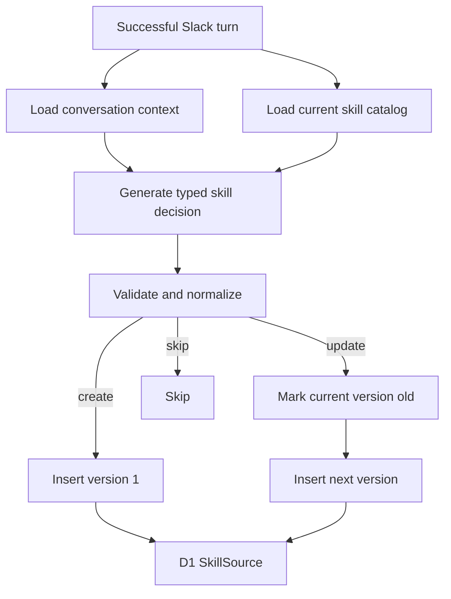

# Improve Generated Skills

## Overview

Improve the generated skills lifecycle so the agent can decide whether to create a new skill, update an existing skill, or skip generation. Generated skill bodies become typed data rendered by application code, and skill updates create new versions instead of mutating the current row in place.

## Problem

The first generated skills implementation was intentionally simple:

- Reflection saw Slack history but not the current skill catalog, so it could create similar duplicate skills.
- The model controlled raw `body` formatting, so stored bodies could be plain text, ad hoc key-value text, JSON, or markdown.
- `version` was incremented in place, so old skill versions were lost.
- Runtime skill loading did not distinguish current versions from old versions.

## Goals

- Pass the current generated skill catalog into reflection.
- Use an explicit `skip`, `create`, or `update` model decision.
- Store typed `body_json` and render canonical `body` text in code.
- Mark old versions with `is_old = 1` and insert a new row for updates.
- Load only current enabled skill versions at runtime.

## Flow



## Schema

Add `migrations/0003_generated_skill_versions.sql`.

The migration rebuilds `generated_skills` to support versioned rows:

- `id TEXT PRIMARY KEY`
- `name TEXT NOT NULL`
- `description TEXT NOT NULL`
- `body TEXT NOT NULL`
- `body_json TEXT NOT NULL`
- `allowed_tools TEXT`
- `version INTEGER NOT NULL`
- `is_old INTEGER NOT NULL DEFAULT 0`
- `disabled INTEGER NOT NULL DEFAULT 0`
- `confidence REAL NOT NULL`
- `auto_approval_reason TEXT NOT NULL`
- `created_at INTEGER NOT NULL`
- `updated_at INTEGER NOT NULL`
- `UNIQUE(name, version)`

Legacy rows are copied from `generated_skills_legacy` with `is_old = 0` and a simple legacy `body_json` wrapper.

## Typed Skill Body

Generated skill bodies use this shape:

```ts
type GeneratedSkillBody = {
  goal: string;
  triggers: string[];
  instructions: string[];
  safetyNotes?: string[];
  toolUsage?: Array<{
    tool: "getSlackHistoryContext";
    when: string;
  }>;
};
```

The model returns typed body fields. Application code renders the final body text through `renderGeneratedSkillBody()`.

## Reflection Contract

The reflection model returns:

```ts
type SkillReflectionDecision =
  | { action: "skip"; reason: string; confidence: number }
  | { action: "create"; candidate: TypedSkillCandidate }
  | { action: "update"; existingSkillName: string; candidate: TypedSkillCandidate };
```

Reflection receives a compact current skill catalog and must choose:

- `create` only for genuinely new reusable workflows.
- `update` when an existing skill covers the same workflow and should be improved.
- `skip` when the pattern is weak or already covered.

## Persistence Behavior

For `create`:

- Insert `version = 1`.
- Set `is_old = 0`.

For `update`:

- Find the current row by `existingSkillName`.
- If the current row is disabled, return `skipped_disabled`.
- If the rendered body, description, and allowed tools are unchanged, return `unchanged`.
- Mark the current row `is_old = 1`.
- Insert a new row with `version = previous.version + 1` and `is_old = 0`.

Runtime loading:

- `listEnabledSkills()` returns only `disabled = 0 AND is_old = 0`.
- `loadEnabledSkill(name)` returns only the current enabled version.

## Logging

Extend `[gen-skills]` logs with:

- current skill catalog count;
- model action;
- existing skill name for updates;
- candidate name;
- saved version;
- `isOld` and `disabled` state.

Do not log full Slack messages, full history context, or full body JSON.

## Tests

Add or update tests for:

- typed body rendering;
- create inserting version 1;
- update marking the old row and inserting version + 1;
- disabled skills not being re-enabled;
- current runtime source filtering;
- existing skill catalog passed into reflection;
- prompt and schema using `skip`, `create`, and `update`.

## Verification

Run:

```sh
npm run typecheck
npm test
npx wrangler deploy --dry-run
npx wrangler d1 migrations apply slack-ai-agent-v3-history --local
```
