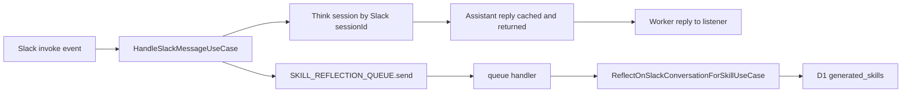

# Async Slack Turn Reflection Via Queue

## Direction

Use Cloudflare Queues for `reflectOnSlackTurn`. The Slack request should wait only for the main Think reply and a lightweight queue enqueue, not for the reflection model call or generated-skill persistence.

Reflection should not use the Slack conversation `sessionId`. It only needs `event`, `assistantReply`, D1 history, generated-skill storage, and a Workers AI model. The main `sessionId` remains dedicated to the user-facing Think conversation, while reflection runs as an independent queue job.



## Implementation Plan

1. Remove reflection from the critical Think path in `src/modules/agent/think-agent.ts`: keep `cacheSlackTurnReply(...)`, then return `{ text: replyText }` without calling `reflectOnSlackTurn`.

```ts
this.cacheSlackTurnReply(input.event.idempotencyKey, replyText);
return { text: replyText };
```

2. Add a queue job contract in `src/modules/agent/skill-reflection-job.ts` with `version`, `idempotencyKey`, `event`, `assistantReply`, and `createdAt`. Validate queue message bodies with `zod` in the consumer because queue payloads are external input.

3. Add `SkillReflectionQueuePort` and a Cloudflare Queue adapter. Inject it into `HandleSlackMessageUseCase` and enqueue only after a non-empty invoke reply is available. Capture-only events, duplicate Slack messages, and empty replies must not enqueue.

4. Add Queue bindings to `wrangler.jsonc` as both producer and consumer for the same Worker, using `SKILL_REFLECTION_QUEUE` and queue name `slack-ai-agent-v3-skill-reflection`.

5. Extend Worker env typing where needed. The queue producer belongs in the Worker/use-case path; the queue consumer runs reflection directly in the Worker using D1 and Workers AI, so no reflection `sessionId` is required.

6. Add an `async queue(batch, env, ctx)` handler in `src/cmd/worker/index.ts`. For each validated job, run `ReflectOnSlackConversationForSkillUseCase` with `D1SlackMessageHistoryAdapter`, `D1GeneratedSkillAdapter`, and a shared Workers AI model factory. Use awaited queue work so Cloudflare Queues can retry failed messages.

7. Refactor model creation out of `SlackThinkAgent.getModel()` into a small shared helper, reusing `src/modules/agent/agent-ai-gateway.ts`, so both the Think Agent and queue consumer create the same Workers AI model consistently.

8. Add queue idempotency. Because Queues are at-least-once and reflection can update generated skills, add a D1-backed reflection job ledger keyed by Slack `idempotencyKey`. The consumer should skip already completed jobs and mark completed/skipped after a successful reflection decision.

9. Adjust reflection error behavior for queue retries. `ReflectOnSlackConversationForSkillUseCase` normally converts failures to `skipped`; queue processing can opt into strict error propagation so unexpected infrastructure, model, or storage failures trigger retry.

10. Add or update tests for successful enqueue, skipped enqueue paths, job validation, queue adapter payloads, ledger idempotency, and strict reflection error behavior.

11. Update repository docs and rules to describe that post-turn reflection is queue-backed and independent from Slack conversation sessions.

## Acceptance Criteria

- Slack invoke response no longer waits for `ReflectOnSlackConversationForSkillUseCase.execute()`.
- Main Think `sessionId` remains unchanged for DM/thread conversation state.
- Reflection jobs do not use per-thread/per-DM `sessionId`; they carry typed `event + assistantReply` payloads.
- Queue consumer retries unexpected reflection failures and skips already completed jobs idempotently.
- `npm run typecheck` and `npm test` pass.
- For config changes, `npx wrangler deploy --dry-run` is run before completion.

## Risks

- Queue enqueue still adds a small amount of latency because `Queue.send()` confirms the message is written. This is acceptable because it replaces the much slower reflection model call.
- If queue send fails, the Worker logs the failure and still returns the Slack reply because generated-skill learning is background work.
- Reflection retry semantics require strict error propagation for queue processing while preserving safe skipped results for non-queue callers.
