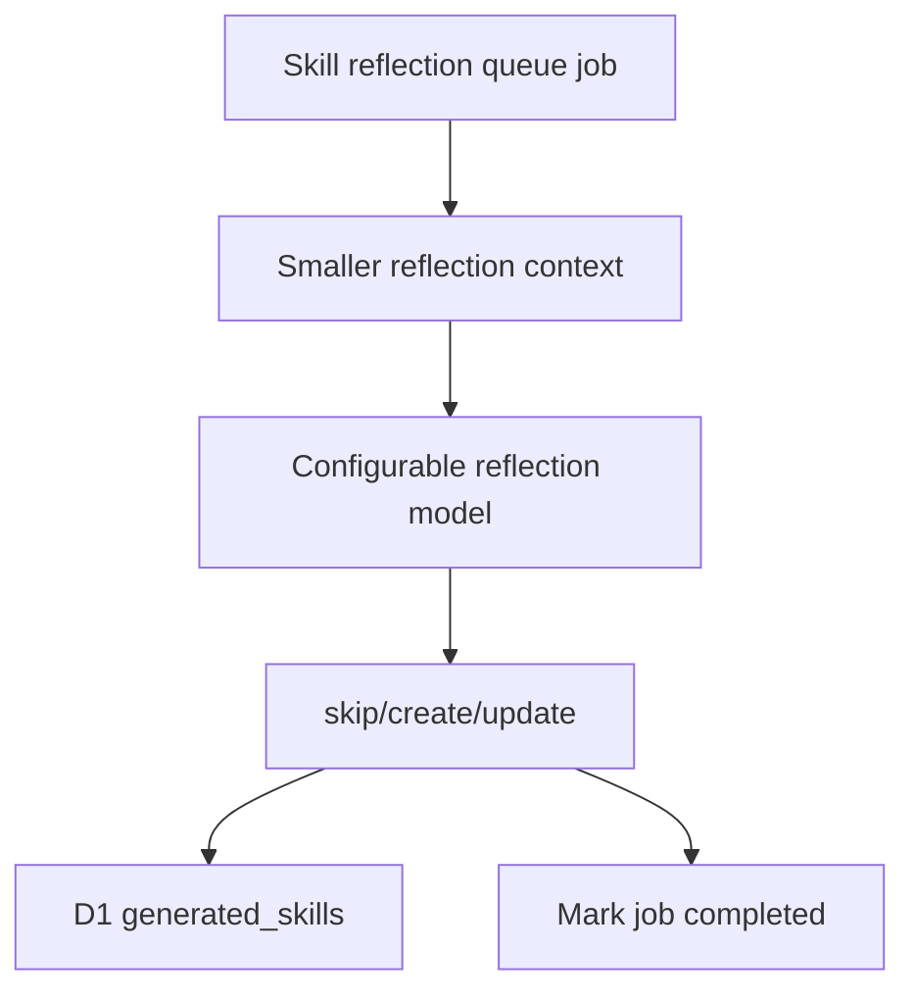

# Faster Skill Reflection Without Timeouts

## Diagnosis

The timeout is happening inside the Workers AI reflection call, not in Queue, D1, or `@cloudflare/think`. The current reflection path uses the same default large model as the main Slack agent with structured JSON output.

Gemma 4 can be cheaper than some Llama variants, but a cheap model is not useful if reflection jobs consistently timeout and retry. The implementation keeps reflection running for every queue job, keeps the default reflection model cost-conscious, and makes the model easy to switch if timeout behavior continues.

## Proposed Flow

## Implementation Plan

1. Introduce a dedicated reflection model setting, separate from the main Slack agent model:
   - add `REFLECTION_AI_MODEL` to `wrangler.jsonc`, defaulting to `@cf/google/gemma-4-26b-a4b-it` for cost continuity;
   - document `@cf/meta/llama-3.1-8b-instruct-fp8-fast` as the fast fallback if Gemma 4 continues to timeout;
   - extend Worker env types in `src/cmd/worker/index.ts`;
   - keep `AI_MODEL` for the main `SlackThinkAgent` unchanged.

2. Update `src/modules/agent/agent-model.ts` to expose a reflection model factory using the new `REFLECTION_AI_MODEL`. For reasoning-capable models, set provider options to disable thinking/reasoning by default because reflection is extraction/classification work and reasoning increases latency.

3. Change the queue consumer in `src/cmd/worker/index.ts` to use the reflection model factory instead of the main Slack agent model factory.

4. Reduce reflection prompt/context size while still processing every message:
   - lower reflection history from 14 days / up to 500 messages to 3 days and 50 messages;
   - keep enough context for real workflow detection but avoid sending large threads into every reflection call;
   - make the limits named constants so they are easy to tune.

5. Simplify model work:
   - keep structured output for now, but make the prompt strongly bias toward concise `skip` decisions when no reusable workflow exists;
   - optionally replace the current `oneOf` schema later with a two-stage flow: first classify `skip/create/update`, then only generate full skill body for `create/update`.

6. Add observability for latency and payload size:
   - log reflection model elapsed time;
   - log reflection model name, `historyContextLength`, `existingSkillCount`, decision action, and timeout/error message;
   - include `idempotencyKey` in queue-runner logs where available;
   - use these logs to decide whether to keep Gemma 4 or switch `REFLECTION_AI_MODEL` to the fast fallback.

7. Keep Queue retry behavior:
   - if Workers AI timeout still occurs, retry as today;
   - after max queue retries, the dead-letter queue captures failures;
   - do not block Slack replies.

## Acceptance Criteria

- Every valid reflection queue job still reaches the model call unless skipped by existing idempotency ledger state.
- Reflection uses `REFLECTION_AI_MODEL`, not the main `AI_MODEL`.
- Default reflection model remains `@cf/google/gemma-4-26b-a4b-it`, with `@cf/meta/llama-3.1-8b-instruct-fp8-fast` documented as the timeout fallback.
- Main Slack agent behavior and `sessionId` mapping remain unchanged.
- Queue jobs still use D1 ledger idempotency and retry unexpected failures.
- `npm run typecheck`, `npm test`, and `npx wrangler deploy --dry-run` pass.

## Risks

- Keeping Gemma 4 as default may not resolve the current timeout by itself. Mitigation: reduce context and disable reasoning first; if timeouts persist, switch `REFLECTION_AI_MODEL` to the fast fallback without changing code.
- A smaller fallback model may be less reliable at creating rich skill bodies. Mitigation: only switch if Gemma 4 remains unstable; if quality is poor, add a two-stage flow where only create/update candidates use a stronger model.
- JSON schema structured output can still be slow on some models. Mitigation: reduce prompt/context first and keep the two-stage simplification as the next fallback.
