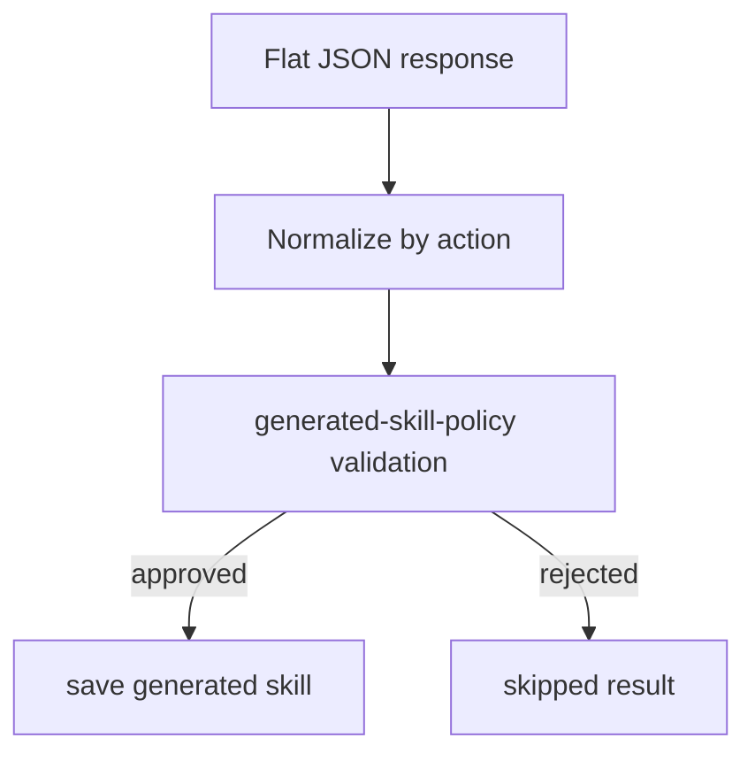

# Compact Skill Reflection Schema

## Diagnosis

The latest reflection failure is not a Workers AI timeout. The model returns a response, but it can stop with `finish_reason: "length"` at the configured completion token limit, producing incomplete JSON. The previous reflection schema was large because it used a discriminated union that produced a `oneOf` schema with duplicated `candidate` branches for `create` and `update`.

The policy layer already validates semantic requirements after parsing, so the model-facing schema can be flatter and smaller.

## Proposed Flow

## Implementation Plan

1. Increase `SKILL_REFLECTION_MAX_OUTPUT_TOKENS` in `src/modules/agent/skill-reflection.use-case.ts` from `800` to `2000`. This gives Gemma enough room to finish create/update JSON while staying bounded.

2. Replace the model-facing discriminated union schema with a compact flat schema:
   - `action: "skip" | "create" | "update"`
   - `reason: string`
   - `confidence: number`
   - optional `existingSkillName`
   - optional `candidate`

3. Add a small normalizer function in `src/modules/agent/skill-reflection.use-case.ts` that converts the flat model output into the existing `SkillReflectionDecision` union:
   - `skip` returns `{ action: "skip", reason, confidence }`;
   - `create` requires `candidate`, otherwise normalizes to a skipped decision;
   - `update` requires both `existingSkillName` and `candidate`;
   - candidate-level `reason` can fall back to top-level `reason` if the model omits it.

4. Keep `validateGeneratedSkillCandidate(...)` unchanged. It remains the authoritative policy layer for confidence threshold, kebab-case names, allowed tools, secrets, Slack IDs, and unsafe instructions.

5. Tighten prompts in `src/prompts/skill-reflection.prompts.ts`:
   - ask for compact JSON only;
   - ask for no whitespace or text after the JSON object;
   - cap create/update arrays to at most 3 `triggers`, 5 `instructions`, and 3 `safetyNotes`;
   - keep `reason`, `goal`, trigger, and instruction text concise.

6. Add tests for flat create/update normalization, missing candidate handling, reason fallback, output token budget, and compact prompt guidance.

7. Update docs to explain that reflection uses compact structured output and leaves strict validation to TypeScript policy code.

## Acceptance Criteria

- The Workers AI request no longer sends a large `oneOf` schema with duplicated create/update candidate branches.
- `SKILL_REFLECTION_MAX_OUTPUT_TOKENS` is high enough for valid create/update output, default `2000`.
- Existing policy validation remains unchanged.
- Flat create/update/skip model outputs are normalized into the existing internal decision union.
- `npm run typecheck`, `npm test`, and `npx wrangler deploy --dry-run` pass.

## Risks

- A flatter schema moves some required-field validation from JSON schema into code. This is acceptable because `generated-skill-policy` already enforces the real safety and quality rules.
- Raising output tokens can increase cost for bad generations. Compact prompt guidance and array caps reduce unnecessary output; if Gemma still emits trailing whitespace, switch `REFLECTION_AI_MODEL` to the fast fallback or add a two-stage flow later.
