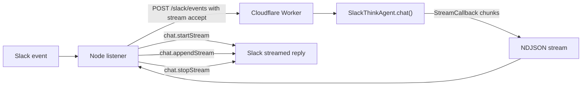

# Plan: Think StreamCallback -> Slack Stream API

## Goal

Replace the current invoke path, where the Worker waits for `saveMessages()` and returns final JSON, with streaming delivery:

## Main Approach

- Keep the Slack Bot token and Slack Web API in the Node listener; do not move Slack API access into the Worker.
- Add a streaming contract between the listener and Worker, most likely NDJSON through the same `[src/modules/slack/slack.handler.ts](src/modules/slack/slack.handler.ts)` endpoint with `Accept: application/x-ndjson`, or through a separate method in the client port.
- Add a streaming path in the Worker only for `processingIntent: "invoke"`; `capture`, duplicates, invalid auth/body, and errors that happen before Think starts still return typed terminal events or existing JSON-compatible errors.
- In the Think adapter, move from final `saveMessages()` to `chat()` + `StreamCallback` for streaming turns, while preserving final text extraction/caching and idempotency behavior.

## Planned Changes

- Update Think port contracts:
  - `[src/ports/think-session.port.ts](src/ports/think-session.port.ts)` adds a streaming submission method such as `streamSlackMessage(input, callbacks)`.
  - Keep `submitSlackMessage()` if needed for tests/backward fallback, or replace it only where all call sites are migrated.

- Update Think agent integration:
  - `[src/modules/agent/think-agent.ts](src/modules/agent/think-agent.ts)` adds a method like `runSlackTurnStream()`.
  - It will call Think `chat(userMessage, StreamCallback)` instead of `saveMessages()` for streamed turns.
  - It will set `activeSlackEvent` for tool context during the full streamed turn.
  - It will accumulate assistant text, cache final replies by idempotency key, and still support cached replies.
  - It will handle `onError` and `onInterrupted` explicitly so partial text is not treated as a completed answer.

- Add a small stream event protocol between Worker and listener:
  - Events like `delta`, `done`, `no_reply`, `error`, and optionally `started`.
  - Worker should parse Think `UIMessageChunk` JSON internally and emit text deltas, so the listener does not need to understand Think chunk internals.
  - Add focused parsing tests for text delta extraction from `UIMessageChunk`-like payloads.

- Update Worker handling:
  - `[src/modules/slack/handle-slack-message.use-case.ts](src/modules/slack/handle-slack-message.use-case.ts)` should expose a streaming execute path that saves history first, skips duplicates/capture-only events, streams Think deltas, and enqueues skill reflection after final non-empty replies.
  - `[src/modules/slack/slack.handler.ts](src/modules/slack/slack.handler.ts)` should return a streaming `Response` for streaming requests and keep the existing JSON path where appropriate.
  - `[src/cmd/worker/index.ts](src/cmd/worker/index.ts)` wires the updated adapter/use case without adding Slack credentials to Worker env.

- Update listener Worker client:
  - `[src/ports/worker-event-client.port.ts](src/ports/worker-event-client.port.ts)` gets a streaming method or callback-based variant.
  - `[src/adapters/worker/worker-event-client.adapter.ts](src/adapters/worker/worker-event-client.adapter.ts)` reads the Worker streaming response, decodes NDJSON incrementally, and calls listener callbacks.
  - It should preserve retry behavior for failures before streaming starts, but avoid retrying after Slack stream delivery has begun unless the error is clearly safe.

- Add Slack streaming port methods:
  - `[src/ports/slack-messenger.port.ts](src/ports/slack-messenger.port.ts)` adds `startStream`, `appendStream`, and `stopStream` types.
  - `[src/adapters/slack/slack-socket-mode.adapter.ts](src/adapters/slack/slack-socket-mode.adapter.ts)` implements them with `app.client.chat.startStream`, `app.client.chat.appendStream`, and `app.client.chat.stopStream`.
  - Use `channel`, `thread_ts`, `recipient_team_id`, `recipient_user_id`, and markdown/chunks payloads as required by Slack streaming docs.

- Update listener orchestration:
  - `[src/modules/slack-listener/slack-listener.use-case.ts](src/modules/slack-listener/slack-listener.use-case.ts)` streams only invoke responses.
  - Start the Slack stream on the first text delta, append subsequent deltas, stop with the final full text, then capture the bot reply back into Worker history using the stream message timestamp.
  - Preserve existing behavior for `no_reply`, capture-only events, fallback errors, and tracked thread metadata.

## Tests

- Update or add tests in:
  - `[src/modules/agent/think-agent.test.ts](src/modules/agent/think-agent.test.ts)` for streamed turn completion/caching/error behavior where practical.
  - `[src/adapters/think/think-session.adapter.ts](src/adapters/think/think-session.adapter.ts)` tests if a dedicated adapter test exists or add focused coverage near existing Think tests.
  - `[src/modules/slack/handle-slack-message.use-case.test.ts](src/modules/slack/handle-slack-message.use-case.test.ts)` for streaming invoke, duplicate no-stream, empty final reply, and reflection enqueue after done.
  - `[src/modules/slack/slack.handler.test.ts](src/modules/slack/slack.handler.test.ts)` for NDJSON streaming responses and existing JSON compatibility.
  - `[src/adapters/worker/worker-event-client.adapter.test.ts](src/adapters/worker/worker-event-client.adapter.test.ts)` for incremental stream parsing and terminal events.
  - `[src/modules/slack-listener/slack-listener.use-case.test.ts](src/modules/slack-listener/slack-listener.use-case.test.ts)` for start/append/stop flow and bot reply capture after stop.
  - `[src/adapters/slack/slack-socket-mode.adapter.test.ts](src/adapters/slack/slack-socket-mode.adapter.test.ts)` for request argument mapping to Slack stream API.

## Verification

- Run `npm run typecheck`.
- Run `npm test`.
- If Worker handler/types change significantly, run `npx wrangler deploy --dry-run` after loading the Wrangler skill/checking current command expectations.

## Notes and Risks

- Slack streaming API requires thread-oriented delivery. The listener already computes `threadTs` as `event.threadTs ?? event.messageTs`, which matches this requirement.
- `onEvent(json)` from Think returns serialized `UIMessageChunk`, not plain text; the implementation must extract only assistant text deltas and ignore non-text/tool/status chunks unless intentionally mapped later.
- Once Slack streaming has started, retry semantics change: replaying the same Worker stream could duplicate visible output. Retries should remain conservative after first successful `chat.startStream`.
- If Slack `chat.*Stream` methods are unavailable in TypeScript despite `@slack/web-api` 7.16.0, use the SDK's generic API call shape or narrow local types instead of introducing `any`.
