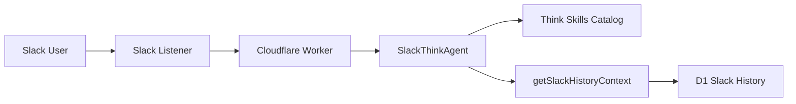
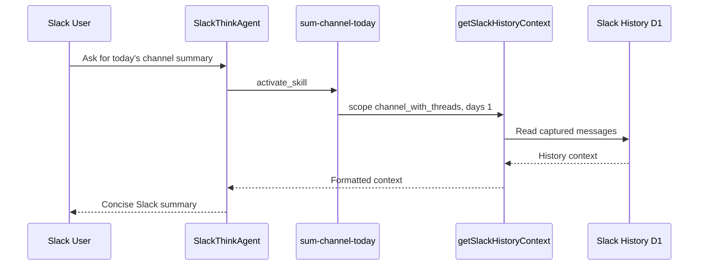

# Add Agent Skills

## Overview

Add first-class Think Agent Skills to the Slack agent, starting with `sum-channel-today`.

The first skill helps the model recognize requests for a summary of today's current Slack channel and use the existing `getSlackHistoryContext` tool before answering. It is implemented as a local skill manifest source, not as an executable skill script.

## Current State

- `SlackThinkAgent` already exposes `getSlackHistoryContext`.
- `getSlackHistoryContext` reads captured Slack history through `BuildSlackHistoryContextUseCase` and `D1SlackMessageHistoryAdapter`.
- The repository does not currently have `vite.config.*` with `agents/vite`.
- `wrangler.jsonc` does not currently define a `worker_loaders` binding.
- Because executable skill scripts require extra Worker Loader infrastructure, the first implementation uses the first-class Think skills catalog only.

## Architecture



## Runtime Flow



## Implementation Steps

1. Create `src/modules/agent/agent.skills.manifest.ts`.
2. Register the first skill with `name: "sum-channel-today"`.
3. Limit the skill to the existing `getSlackHistoryContext` tool through `allowedTools`.
4. Instruct the skill to call `getSlackHistoryContext` with `scope: "channel_with_threads"` and `days: 1`.
5. Create `src/modules/agent/agent.skills.ts`.
6. Export a local `SkillSource` with `skills.fromManifest(...)`.
7. Wire the local skill source into `SlackThinkAgent.getSkills()`.
8. Add a focused Vitest test for the manifest and skill body.
9. Verify with typecheck and tests.

## Files

- `src/modules/agent/agent.skills.ts`
- `src/modules/agent/agent.skills.manifest.ts`
- `src/modules/agent/agent.skills.test.ts`
- `src/modules/agent/think-agent.ts`

## Verification

Run:

```sh
npm run typecheck
npm test
```

The test should confirm that:

- The local skill source registers `sum-channel-today`.
- The skill allows `getSlackHistoryContext`.
- The skill body instructs the agent to use `channel_with_threads` and `days: 1`.
- The skill handles the no-history case without inventing details.

## Risks And Assumptions

- This feature depends on captured D1 Slack history. It cannot summarize messages that were not captured.
- The skill is an instruction source, not a deterministic command handler. The model still chooses when to activate it based on the skills catalog.
- The default summary scope includes thread replies because channel summaries are more useful with thread context.
- No Worker Loader binding is added in this feature.

## Future Option

If `sum-channel-today` needs to become an executable script under `scripts/`, add Worker Loader infrastructure separately:

- Add the required `worker_loaders` binding in `wrangler.jsonc`.
- Add `getSkillScriptRunner()` to `SlackThinkAgent`.
- Add the runtime dependencies required by Think skill script execution.
- Add focused tests or integration checks for `run_skill_script`.
