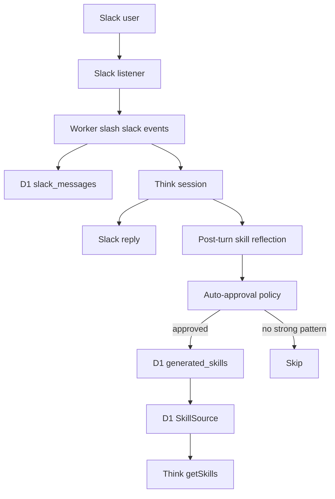

# Auto-Generated Skills

## Overview

Add an MVP self-improvement loop where the Slack agent reflects on successful invoked conversations, extracts reusable procedural patterns, auto-approves safe candidates through deterministic policy checks, stores approved skills in D1, and uses only enabled database-backed skills at runtime.

There is no admin UI in this version. A skill can be disabled directly in D1 through the `disabled` boolean column. Disabled skills remain stored for auditability but are not listed or loaded by the Think skill source.

## Goals

- Store generated skills in D1 as the source of truth.
- Keep generated skills universal, not tied to a Slack workspace, channel, thread, message, or user.
- Use only D1-backed skills in `SlackThinkAgent.getSkills()`.
- Remove runtime dependence on repository skill manifests.
- Auto-approve only candidates that pass strict validation.
- Preserve the ability to disable skills through the database.

## Runtime Flow



## Data Model

Add `migrations/0002_generated_skills.sql`:

```sql
CREATE TABLE IF NOT EXISTS generated_skills (
  id TEXT PRIMARY KEY,
  name TEXT NOT NULL UNIQUE,
  description TEXT NOT NULL,
  body TEXT NOT NULL,
  allowed_tools TEXT,
  version INTEGER NOT NULL DEFAULT 1,
  disabled INTEGER NOT NULL DEFAULT 0,
  confidence REAL NOT NULL,
  auto_approval_reason TEXT NOT NULL,
  created_at INTEGER NOT NULL,
  updated_at INTEGER NOT NULL
);
```

Do not store Slack source metadata such as `team_id`, `channel_id`, `thread_ts`, or `message_ts` on skill records. Generated skills must be universal.

Do not store `fingerprint` as a database column. `fingerprint` belongs to the `SkillSource` and represents the source catalog state, not an individual skill record.

## Storage Boundary

Add `GeneratedSkillPort` in `src/ports/generated-skill.port.ts` with methods to:

- Upsert auto-approved skills by `name`.
- List enabled skills for catalog loading.
- Load enabled skill content by `name`.
- Find any skill by `name` to preserve disabled state.
- Read enabled catalog stats if source fingerprinting needs them later.

The D1 adapter lives in `src/adapters/storage/d1-generated-skill.adapter.ts`. An in-memory adapter lives in `src/adapters/storage/in-memory-generated-skill.adapter.ts` for tests.

## Disabled Invariant

Auto-generation must not re-enable a disabled skill. If a generated candidate has the same `name` as an existing disabled skill, the upsert returns `skipped_disabled` and leaves the row disabled.

## Skill Source

Add `src/modules/agent/generated-skill-source.ts` to implement `SkillSource`:

- `id = "slack-agent-generated-skills"`.
- `list()` returns only `disabled = 0` skills.
- `load(name)` returns only enabled skill content.
- `fingerprint` is a source-level value.

Update `src/modules/agent/agent.skills.ts` so `createSlackAgentSkillSources(repository)` returns only the D1-backed generated skill source.

Update `src/modules/agent/think-agent.ts` so `getSkills()` creates a `D1GeneratedSkillAdapter` from `this.env.SLACK_HISTORY_DB` and returns only the generated skill source.

## Reflection

Add `src/modules/agent/skill-reflection.use-case.ts`:

- Runs after a successful `runSlackTurn()` and after reply caching.
- Reads recent captured Slack history through `SlackMessageHistoryPort`.
- Uses structured model output to propose a skill candidate.
- Validates the candidate with deterministic policy checks.
- Saves only approved skills.
- Returns `skipped` for weak candidates or model failures so Slack replies are not broken.

Add `src/modules/agent/skill-reflection.prompts.ts` to keep reflection prompts close to the agent module.

## Auto-Approval Policy

Add `src/modules/agent/generated-skill-policy.ts` with checks for:

- `confidence >= 0.85`.
- Lowercase kebab-case skill names.
- Description includes a clear `Use when` trigger.
- Body is non-empty and bounded in size.
- Allowed tools are limited to `getSlackHistoryContext`.
- No obvious secrets, credentials, Slack identifiers, private facts, or user-specific instructions.
- No instructions that weaken system, security, or policy rules.

Rejected candidates are not stored in this MVP.

## Tests

Add focused tests for:

- Generated skill policy approval and rejection cases.
- D1 adapter insert, update, unchanged, disabled, list, and load behavior.
- D1-backed `SkillSource` list/load behavior.
- Reflection use case approved, skipped, and failure paths.
- Runtime skill source factory using only the generated DB source.

## Verification

Run:

```sh
npm run typecheck
npm test
npx wrangler deploy --dry-run
```

Validate the migration locally when practical:

```sh
npx wrangler d1 migrations apply slack-ai-agent-v3-history --local
```

## Out Of Scope

- Admin UI.
- Slack admin commands for skill review.
- Manual review workflow.
- Local export to `.cursor/skills`.
- Separate D1 database or binding for skills.
- Queue-backed reflection jobs.
