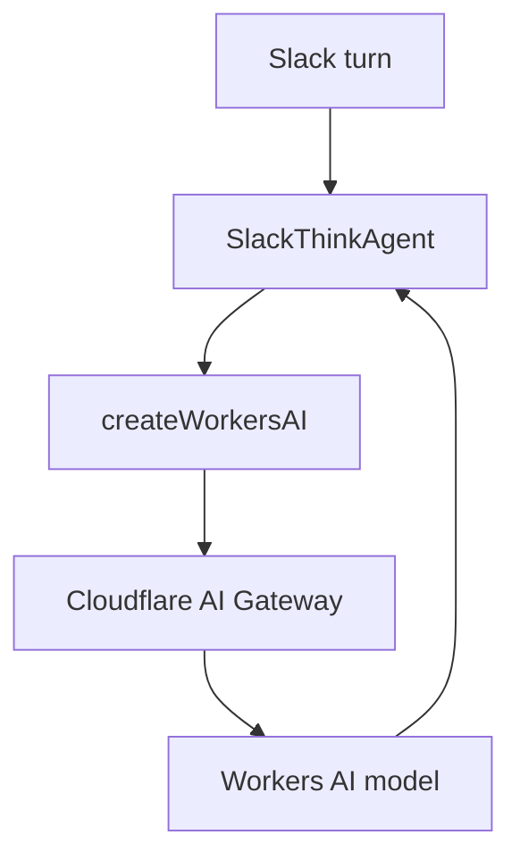

# Cloudflare AI Gateway

## Overview

Add Cloudflare AI Gateway to the existing `@cloudflare/think` and Workers AI model path without changing the Slack agent architecture. The implementation uses the installed `workers-ai-provider` support for `gateway` options so every model call from `SlackThinkAgent` goes through AI Gateway.

## Goals

- Keep `@cloudflare/think` as the agent runtime.
- Keep Workers AI behind the existing `createWorkersAI()` provider.
- Route model requests through Cloudflare AI Gateway.
- Configure the gateway through Worker environment variables.
- Preserve local development defaults.

## Runtime Flow



## Implementation

Update `src/modules/agent/think-agent.ts` so `getModel()` passes gateway options to `createWorkersAI()`:

- Build gateway options from `AI_GATEWAY_ID`.
- Trim configured gateway IDs.
- Fall back to Cloudflare's `default` gateway when the value is missing or blank.
- Do not add a separate AI Gateway binding or universal gateway API path for this MVP.

Update environment types in:

- `src/modules/agent/agent.types.ts`
- `src/cmd/worker/index.ts`

Add `AI_GATEWAY_ID=default` to:

- `wrangler.jsonc`
- `.dev.vars.example`

## Tests And Documentation

Add focused tests for the gateway helper:

- Missing gateway ID uses `default`.
- Configured gateway IDs are trimmed.
- Blank gateway IDs fall back to `default`.

Update repository documentation so `README.md` and `AGENTS.md` mention:

- `SlackThinkAgent.getModel()` creates the Workers AI model with Cloudflare AI Gateway enabled.
- `AI_GATEWAY_ID` is an important Worker var.
- `default` is the recommended value unless a named gateway is required.

## Verification

Run:

```sh
npm run typecheck
npm test
npx wrangler deploy --dry-run
```
